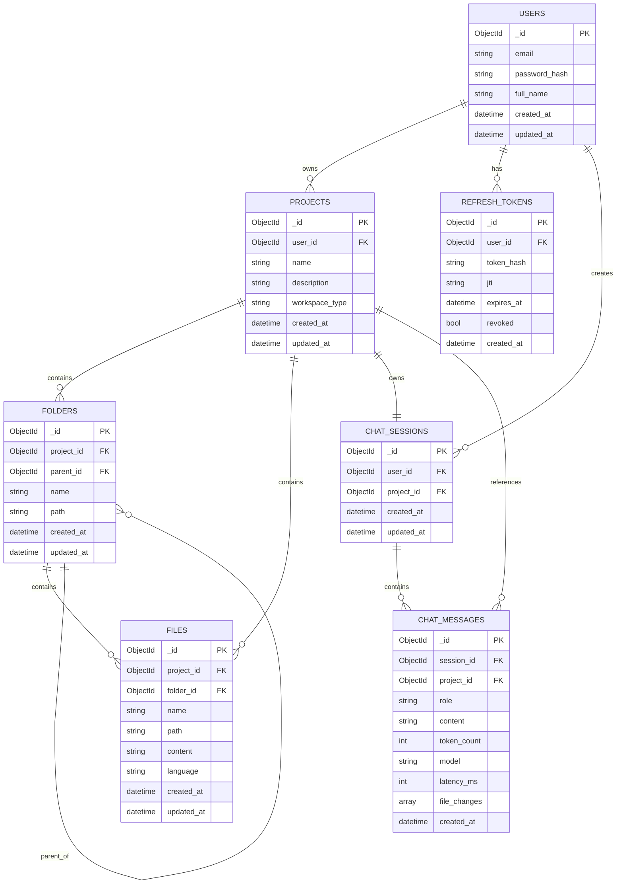

# AI Coding Workspace Database Architecture

## Overview

The AI Coding Workspace uses **MongoDB** as the primary database. Although MongoDB is a NoSQL database and does not enforce foreign key constraints, the application maintains logical relationships using **ObjectId references**.


# Entity Relationship Diagram (ERD)

## Mermaid ER Diagram




---

# ASCII Entity Relationship Diagram

```text
                                          USERS
    ┌──────────────────────────────────────────────────────────────┐
    │ PK  _id                                                      │
    │ email                                                        │
    │ password_hash                                                │
    │ full_name                                                    │
    │ created_at                                                   │
    │ updated_at                                                   │
    └───────────────┬───────────────────────────────┬──────────────┘
                    │                               │
          1         │                       1       │
          │         │                       │       │
          ▼         ▼                       ▼       ▼

      PROJECTS                REFRESH_TOKENS      CHAT_SESSIONS
 ┌─────────────────┐      ┌──────────────────┐  ┌──────────────────┐
 │ PK _id          │      │ PK _id           │  │ PK _id           │
 │ FK user_id      │      │ FK user_id       │  │ FK user_id       │
 │ name            │      │ token_hash       │  │ FK project_id    │
 │ description     │      │ jti              │  │ created_at       │
 │ workspace_type  │      │ expires_at       │  │ updated_at       │
 │ created_at      │      │ revoked          │  └─────────┬────────┘
 │ updated_at      │      └──────────────────┘            │
 └───────┬─────────┘                                      │
         │                                                │
         │                                                │
         │                                                ▼
         │                                        CHAT_MESSAGES
         │                                 ┌─────────────────────────┐
         │                                 │ PK _id                  │
         │                                 │ FK session_id           │
         │                                 │ FK project_id           │
         │                                 │ role                    │
         │                                 │ content                 │
         │                                 │ token_count             │
         │                                 │ model                   │
         │                                 │ latency_ms              │
         │                                 │ file_changes[]          │
         │                                 │ created_at              │
         │                                 └─────────────────────────┘
         │
         │
         ├───────────────┐
         │               │
         ▼               ▼

     FOLDERS           FILES
 ┌────────────────┐  ┌─────────────────────┐
 │ PK _id         │  │ PK _id              │
 │ FK project_id  │  │ FK project_id       │
 │ FK parent_id   │  │ FK folder_id        │
 │ name           │  │ name                │
 │ path           │  │ path                │
 │ created_at     │  │ content             │
 │ updated_at     │  │ language            │
 └──────┬─────────┘  │ created_at          │
        │            │ updated_at          │
        │            └─────────────────────┘
        │
        ▼

  Recursive Folder Tree
```

---

# Database Relationship Matrix

| Parent Collection | Parent Key | Child Collection | Foreign Key | Cardinality | Description |
|------------------|------------|------------------|-------------|------------|-------------|
| Users | `_id` | Projects | `user_id` | 1 → N | One user owns multiple projects |
| Users | `_id` | Refresh Tokens | `user_id` | 1 → N | Multiple active refresh tokens |
| Users | `_id` | Chat Sessions | `user_id` | 1 → N | User can have chat sessions across projects |
| Projects | `_id` | Folders | `project_id` | 1 → N | Project contains folders |
| Projects | `_id` | Files | `project_id` | 1 → N | Project contains files |
| Projects | `_id` | Chat Sessions | `project_id` | 1 → 1 | One chat session per project |
| Projects | `_id` | Chat Messages | `project_id` | 1 → N | Denormalized project reference |
| Folders | `_id` | Folders | `parent_id` | 1 → N | Recursive folder hierarchy |
| Folders | `_id` | Files | `folder_id` | 1 → N | Folder contains multiple files |
| Chat Sessions | `_id` | Chat Messages | `session_id` | 1 → N | Conversation history |

---

# Folder Hierarchy

```text
Project
│
├── src/
│   │
│   ├── index.js
│   ├── app.js
│   │
│   ├── utils/
│   │   ├── helper.js
│   │   └── logger.js
│   │
│   └── services/
│       └── api.js
│
├── public/
│
└── package.json
```

---

# MongoDB Storage Representation

```text
projects
│
├──────────────┐
│              │
▼              ▼

folders       files

│
├── src
│   ├── utils
│   └── services
│
└── public
```

---

# Chat Workflow

```text
                User
                  │
                  │ Creates
                  ▼
              Project
                  │
                  │ Owns
                  ▼
           Chat Session
                  │
                  │ Contains
                  ▼
          Chat Messages
          ├───────────────────────────────┐
          │                               │
          ├── User Prompt                 │
          ├── Assistant Response          │
          ├── Assistant Response          │
          └── Assistant Response          │
                                          │
                                          ▼
                                  file_changes[]
                                          │
                 ┌────────────────────────┼────────────────────────┐
                 │                        │                        │
                 ▼                        ▼                        ▼
        Create utils.py          Update app.js          Delete temp.js
```

---

# Complete Database Flow

```text
                           USERS
                             │
         ┌───────────────────┼───────────────────┐
         │                   │                   │
         ▼                   ▼                   ▼

    PROJECTS         REFRESH_TOKENS      CHAT_SESSIONS
         │                                      │
         │                                      │
         ├──────────────┐                       │
         │              │                       │
         ▼              ▼                       ▼

     FOLDERS          FILES             CHAT_MESSAGES
         │                                  │
         │                                  │
         ▼                                  ▼

Recursive Folders                    file_changes[]
```

---

# Database Design Principles

| Principle | Implementation |
|-----------|----------------|
| Database | MongoDB |
| Primary Key | `_id (ObjectId)` |
| Relationships | ObjectId References |
| Folder Structure | Recursive Parent Reference |
| Authentication | JWT + Refresh Tokens |
| Project Isolation | One Project per Workspace |
| Chat Isolation | One Chat Session per Project |
| File Tracking | Stored in `file_changes[]` |
| Soft References | Application-Level Foreign Keys |
| Cascade Deletes | Managed by Application Logic |
| Indexing | Email, Project ID, Session ID, Folder ID |

---

# Design Notes

### Users
Stores user authentication and profile information.

### Projects
Represents an isolated coding workspace owned by a user.

### Folders
Implements a recursive tree structure using `parent_id`.

### Files
Stores source code and metadata within folders.

### Chat Sessions
Maintains one AI conversation context for each project.

### Chat Messages
Stores complete conversation history, model metadata, latency metrics, token usage, and generated file modifications.

### Refresh Tokens
Stores hashed JWT refresh tokens with expiration and revocation support.

---

# Architecture Summary

```text
Users
   │
   ├──────────────► Projects
   │                     │
   │                     ├────────► Folders
   │                     │              │
   │                     │              └────────► Files
   │                     │
   │                     └────────► Chat Session
   │                                      │
   │                                      ▼
   │                               Chat Messages
   │                                      │
   │                                      ▼
   │                              file_changes[]
   │
   └──────────────► Refresh Tokens
```

